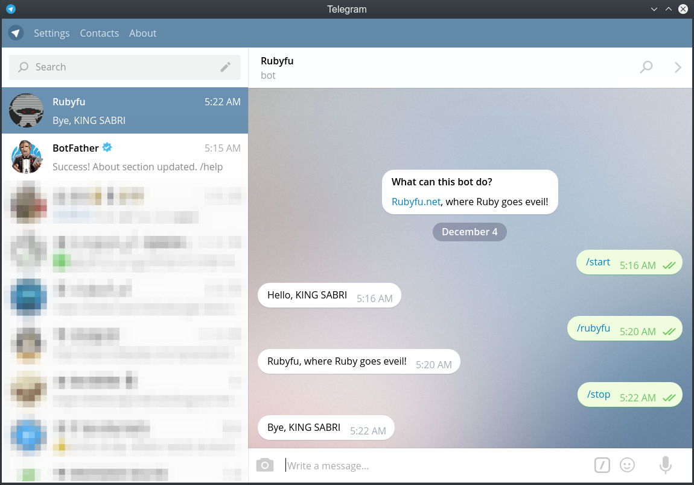

# Telegram API

As we know that Telegram is a messaging app identifies users by their mobile number. Fortunately, Telegram has its own API -_Ruby has a wrapper gem for_ [_Telegram's Bot API_](https://core.telegram.org/bots/api) called [_telegram-bot-ruby_](https://github.com/atipugin/telegram-bot-ruby) - which allows you to Integrate with other services, create custom tools, build single- and multiplayer games, build social services, do virtually anything else; Do you smell anything evil here?

* Install telegram-bot gem 
  ```
  gem install telegram-bot-ruby
  ```

* Basic usage

As many APIs, you have to get a [token](https://core.telegram.org/bots#botfather) to deal with your bot. Here a basic usage

```ruby
require 'telegram/bot'

token = 'YOUR_TELEGRAM_BOT_API_TOKEN'

Telegram::Bot::Client.run(token) do |bot|
  bot.listen do |message|
    case message.text
    when '/start'
      bot.api.send_message(chat_id: message.chat.id, text: "Hello, #{message.from.first_name}")
    when '/stop'
      bot.api.send_message(chat_id: message.chat.id, text: "Bye, #{message.from.first_name}")
    when '/rubyfu'
      bot.api.send_message(chat_id: message.chat.id, text: "Rubyfu, where Ruby goes eveil!")
    end
  end
end
```

Once your run it, go to your telegram and find the bot and start chat with `/start`, try to send `/rubyfu`.



* Inline bots

If you got that evil smile from above example, you may thinking about interacting with your bots [inline](https://core.telegram.org/bots/inline) to call/@mention your bots and request more action from the bot\(s\).

```ruby
require 'telegram/bot'

bot.listen do |message|
  case message
  when Telegram::Bot::Types::InlineQuery
    results = [
      Telegram::Bot::Types::InlineQueryResultArticle
        .new(id: 1, title: 'First article', message_text: 'Very interesting text goes here.'),
      Telegram::Bot::Types::InlineQueryResultArticle
        .new(id: 2, title: 'Second article', message_text: 'Another interesting text here.')
    ]
    bot.api.answer_inline_query(inline_query_id: message.id, results: results)
  when Telegram::Bot::Types::Message
    bot.api.send_message(chat_id: message.chat.id, text: "Hello, #{message.from.first_name}!")
  end
end
```

**Resources**

* A good topic about Quickly Create a Telegram Bot in Ruby can be found [here](http://www.sitepoint.com/quickly-create-a-telegram-bot-in-ruby/).
* There are more usage and documentation for the [gem](https://github.com/atipugin/telegram-bot-ruby) and the [API](https://core.telegram.org/bots), and you can show us your evil code, and you can pull it in Rubyfu!
* [Bot Revolution. Know your API or die hard.](http://web.neurotiko.com/bots/2015/08/03/bots-know-your-api/)


